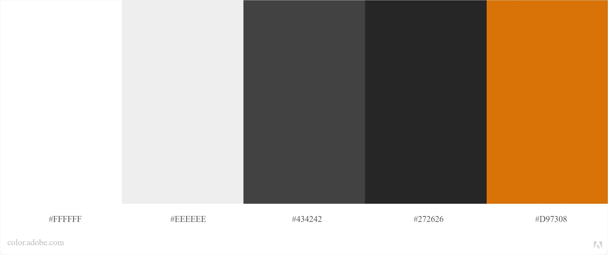
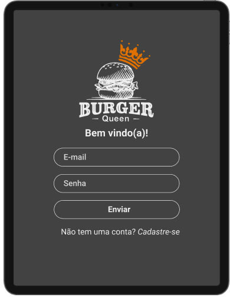
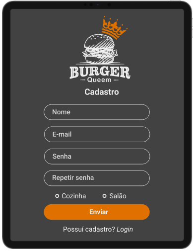
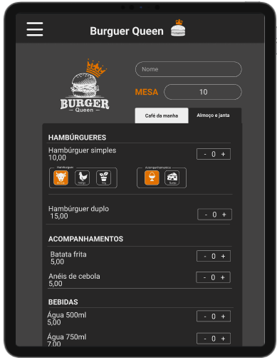
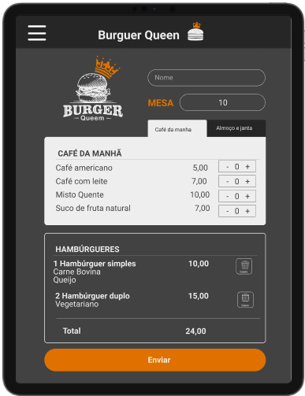
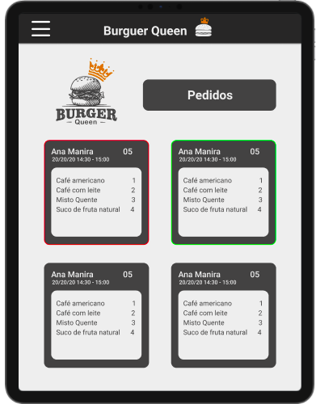
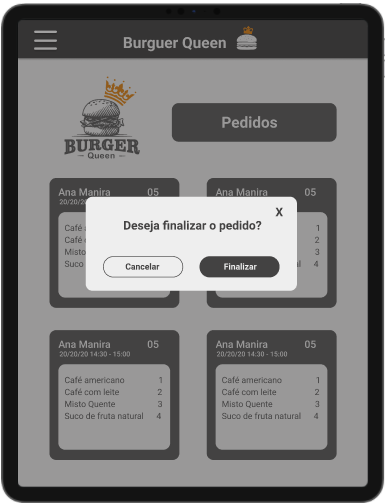

# Burguer Queen

Para acessar a página [clique aqui](https://burgerqueen-004.web.app/).

<!-- IMAGEM -->

## Índice

- [1. Introdução](#1-introdução)
- [2. Definições do projeto](#2-definições-do-projeto)
- [3. Desenvolvimento](#3-desenvolvimento)
- [4. Estrutura e funcionalidades](#4-estrutura-e-funcionalidades)
- [5. Considerações técnicas](#5-considerações-técnicas)
- [6. Implementações futuras](#6-implementações-futuras)
- [7. Autoria](#7-autoria)
- [8. Agradecimentos](#8-agradecimentos)

---

## 1. Introdução

O projeto **Burguer Queen** tem como objetivo atender as necessidades de uma hamburgueria de porte pequeno que necessita de uma interface que possibilite realizar pedidos utilizando um tablet, e enviá-los para a cozinha para que sejam preparados de forma ordenada e eficiente.


Informações do cliente:

> Somos **Burger Queen**, um fast food 24hrs.
>
> A nossa proposta de serviço 24 horas foi muito bem recebida e, para continuar a
> crescer, precisamos de um sistema que nos ajude a receber pedidos de nossos
> clientes.
>
> Nós temos 2 menus. Um muito simples para o café da manhã:
>
> | Ítem                  | Preço R\$ |
> | --------------------- | --------- |
> | Café americano        | 5         |
> | Café com leite        | 7         |
> | Misto Quente          | 10        |
> | Suco de fruta natural | 7         |
>
> E outro menu para o resto do dia:
>
> | Ítem                | Preço   |
> | ------------------- | ------- |
> | **Hambúrgueres**    | **R\$** |
> | Hambúrguer simples  | 10      |
> | Hambúrguer duplo    | 15      |
> | **Acompanhamentos** | **R\$** |
> | Batata frita        | 5       |
> | Anéis de cebola     | 5       |
> | **Bebidas**         | **R\$** |
> | Água 500ml          | 5       |
> | Água 750ml          | 7       |
> | Refrigerante 500ml  | 7       |
> | Refrigerante 750ml  | 10      |
>
> **Importante:** Os clientes podem escolher entre hambúrgueres de carne bovina,
> frango ou vegetariano. Além disso, por um adicional de R\$ 1,00 , eles podem
> adicionar queijo ou ovo.
>
> Nossos clientes são bastante indecisos, por isso é muito comum que eles mudem o
> seu pedido várias vezes antes de finalizar.

A interface deve mostrar os dois menus (café da manhã e restante do dia), cada
um com todos os seus _produtos_. O usuário deve poder escolher que _produtos_
adicionar e a interface deve mostrar o _resumo do pedido_ com o custo total.

## 2. Definições do projeto

### Usuário

Funcionários de uma hamburgueria que fazem atendimento no salão anotando pedidos e que trabalham na cozinha execultando.

### Objetivo

Criar interfaces visuais para facilitar o sistema de pedidos de uma hamburgueria disponíveis para acesso de acordo com o login do usuário.

O usuário que trabanha no salão pode criar pedidos, os enviar para a cozinha e verificar os pedidos que estão prontos para entrega.

Os funcionários da cozinha podem verificar os pedidos em ordem cronológica e envialos de volta para o salão quando estiverem finalizados.

## 3. Desenvolvimento

### Sobre a página

Com objetivo de manter um ambiente agradável para o usuário, foi decidido utilizar uma paleta de cores neutras.



O artigo [Dark UIs: the dos and don’ts.](https://uxdesign.cc/dark-uis-the-good-and-the-bad-dos-and-donts-edefe7a0084e) diz que:

_A fadiga ocular digital é uma condição comum que afeta milhões de pessoas diariamente. Causando, desde o uso excessivo do computador até a exposição regular à luz forte, pode causar dores de cabeça, dores no pescoço, visão turva e queimação / ardência nos olhos._

Tentando minimizar a fadiga do usuário que trabalha no salão, onde passará horas anotando pedidos, foram projetadas telas com tema escuro.

Bauer e Cavonius (1980) diz:

\*...Descobriram que os participantes eram 26% mais precisos ao ler um texto quando o liam com caracteres escuros em um fundo claro.

- Referência: Bauer, D., & Cavonius, C., R. (1980)\*

Tentando facilitar a compreensão dos pedidos que serão lidos pelo usuário que trabalha na cozinha onde precisará olhar para tela o suficiente para ler o pedido, as telas foram projetadas com tema claro por oferecer melhor legibilidade.

### Protótipo

As telas foram projetadas com protótipos de alta fidelidade preferencialmenteno no formato para tablet, mas com a possíbilidade de funcionamento em outros formatos, utilidando a plataforma figma .



Tela de login



Tela de registro


Tela do menu de jantar



Tela do menu jantar com opções de hamburgueres



Tela do menu de café da manhã



Tela dos pedidos



Modal de verificação

### Histórias de Usuário

#### HU 1: Criar perfil

- [x] Poder realizar cadastro com e-mail, senha e função.
- [x] Poder realizar login com e-mail e senha.
- [x] Redirecionar para a tela correta.

#### HU 2: Anotar pedidos

- [x] Digitar o nome do cliente e mesa.
- [x] Filtrar _menu_ para _café da manhã_ e _almoço/jantar_.
- [x] Adicionar item ao pedido.
- [x] Excluir item do pedido.
- [x] Mostrar _resumo_ do pedido com todos os itens e o total.
- [x] Enviar para a cozinha (isso deve salvar o pedido).

#### HU 3: Ver pedidos na cozinha

- [x] Visualizar pedidos pendentes para produção.
- [x] Marcar pedido como pronto para entrega.
- [x] Ver histórico dos pedidos.

#### HU 4: Entrega de pedidos

- [x] Visualizar pedidos pendentes para entrega.
- [x] Marcar pedido como entregue ao cliente.

### UX

- [x] Funciona bem em tablets.
- [x] Fácil utilização em telas sensíveis ao toque.
- [x] Status atual do pedido sempre visível enquanto fazemos um pedido.

## 4. Estrutura e funcionalidades

A aplicação possui 4 telas: login, registro, linha do tempo e perfil, onde:

- O usuário pode logar com email e senha, e pelo Google.
- Também pode se registrar como um novo usuário.

Como usuário logado é permitido:

- Visualizar todos os posts em ordem cronológica.
- Fazer post públicos e privados, com texto e imagens.
- Editar, excluir e alterar a privacidade dos posts.
- Dar _like_ e comentar nas postagens.
- Editar e excluir os comentários.

No seu perfil é permitido:

- Visualizar e alterar seus dados pessoais (nome, foto, profissão, data de nascimento, email e senha).
- Deletar sua conta.

<p align='center'>
 
</p>

## 5. Considerações técnicas

Para a construção do site foi utilizado o software _Visual Studio Code_, utilizando _React_, _NPM_, _Yarn_ e _Git_.  
Sua estilização foi feita em _CSS3_ utilizando o conceito de mobile first e utilizando flexbox para o posicionamento dos elementos.  
Foi utilizado o vanilla _JavaScript_ na manipulação dos dados, funções assíncronas, manipulação do DOM, modularização, uso de callbacks, consumo de promises e template strings, levando em conta a separação de responsabilidade nos arquivos e criação de elementos.  
A manipulação e persistência dos dados foi feita com Firebase através de um banco de dados não relacional, em tempo real, implementando operações CRUD (Criação, Leitura, Atualização e Remoção) de dados.
_[Firebase](https://firebase.google.com/)_ (Hosting, Auth, Database e Firestore).  
Colaboração e armazenamento com _GitHub_.  
Organização com _Trello_.  
Interface hospedada usando _Firebase Hosting_.

### Instalação e execução. :octocat:

- [Clone](https://help.github.com/articles/cloning-a-repository/) o projeto na sua máquina executando o seguinte comando no seu terminal:

```sh
git clone (link-do-repositório)
```

- Instale as dependências do projeto com o comando:

```sh
npm install
```

- Rode o projeto na sua máquina com:

```sh
npm start
```

- E visualize o projeto no seu navegador com o link:

```sh
http://localhost:5000
```

## 6. Implementações futuras

Futuramente serão implementadas funcionalidades para melhoria da experiência do usuário:

- Compartilhar as publicações.
- Salvar publicações.
- Pesquisar por hashtags e usuários.
- Curtir comentários.
- Seguidores e seguir.
- Implementar a página de perfil.
- Incluir vídeos nos posts.
- Implementar stories (vídeos e fotos).
- Visualizar usuários que curtiram.
- Visualizar os próprios posts no perfil.
- Sugestões de amizade e postagens.
- Marcar usuários nos posts.
- Explorar posts.

## 7. Autoria

Este projeto foi feito por [Camila Cunha](https://github.com/camilagerarde), [Gabriela Piovezan](https://github.com/gabrielapiovezan) e [Mariana Barros](https://github.com/MarianaMBarros) com base no projeto da [Laboratoria](https://github.com/Laboratoria).

## 8. Agradecimentos

- [Laboratoria](https://github.com/Laboratoria).
- Ícones e vetores: [Freepik](https://www.flaticon.com/br/autores/freepik), [Pixel Perfect](https://www.flaticon.com/br/autores/pixel-perfect) e [Those Icons](https://www.flaticon.com/br/autores/those-icons).

# Burger Queen - 0041

## Índice

- [1. Preâmbulo](#1-preâmbulo)
- [2. Resumo do projeto](#2-resumo-do-projeto)
- [3. Objetivos de aprendizagem](#3-objetivos-de-aprendizagem)
- [4. Considerações gerais](#4-considerações-gerais)
- [5. Critérios de aceitação mínimos do
  projeto](#5-critérios-de-aceitação-mínimos-do-projeto)
- [6. Hacker Edition](#6-hacker-edition)
- [7. Dicas e leituras complementares](#7-dicas-e-leituras-complementares)

---

## 1. Preâmbulo

[React](https://reactjs.org/), [Angular](https://angular.io/) e
[Vue](https://vuejs.org/) são alguns dos _frameworks_ e _bibliotecas_ de
JavaScript mais usados na área de desenvolvimento ao redor do mundo e existe uma
razão para isso. No contexto do navegador, [_manter a interface sincronizada com
o estado é difícil_](https://medium.com/dailyjs/the-deepest-reason-why-modern-javascript-frameworks-exist-933b86ebc445).

Ao eleger um _framework_ ou _biblioteca_ para nossa interface, nos apoiamos em
uma série de convenções e implementações _testadas_ e _documentadas_ para
resolver um problema comum a toda interface web. Isto nos permite concentrar
melhor (dedicar mais tempo) nas características _específicas_ de nossa
aplicação.

Quando escolhemos uma destas tecnologias não só importamos um pedaço de código
para reusar (o qual já é um grande valor por si só), mas também adotamos uma
**arquitetura**, uma série de **princípios de design**, um paradigma, algumas
**abstrações**, um **vocabulário**, uma **comunidade**, etc...

Como desenvolvedora Front-end, estes kits de desenvolvimento podem resultar em
uma grande ajuda para implementar rapidamente _features_ dos projetos em que
você for trabalhar.

## 2. Resumo do projeto

Desta vez temos um projeto 100% por demanda. Você sempre pode (e deve) fazer
sugestões de melhora e mudança, mas muitas vezes trabalhará em um projeto em que
primeiro deve se assegurar de cumprir os requisitos.

Um pequeno restaurante de hambúrgueres, que está crescendo, necessita uma
interface em que se possa realizar pedidos utilizando um _tablet_, e enviá-los
para a cozinha para que sejam preparados de forma ordenada e eficiente.


Estas são as informações que temos do cliente:

> Somos **Burger Queen**, um fast food 24hrs.
>
> A nossa proposta de serviço 24 horas foi muito bem recebida e, para continuar a
> crescer, precisamos de um sistema que nos ajude a receber pedidos de nossos
> clientes.
>
> Nós temos 2 menus. Um muito simples para o café da manhã:
>
> | Ítem                  | Preço R\$ |
> | --------------------- | --------- |
> | Café americano        | 5         |
> | Café com leite        | 7         |
> | Misto Quente          | 10        |
> | Suco de fruta natural | 7         |
>
> E outro menu para o resto do dia:
>
> | Ítem                | Preço   |
> | ------------------- | ------- |
> | **Hambúrgueres**    | **R\$** |
> | Hambúrguer simples  | 10      |
> | Hambúrguer duplo    | 15      |
> | **Acompanhamentos** | **R\$** |
> | Batata frita        | 5       |
> | Anéis de cebola     | 5       |
> | **Bebidas**         | **R\$** |
> | Água 500ml          | 5       |
> | Água 750ml          | 7       |
> | Refrigerante 500ml  | 7       |
> | Refrigerante 750ml  | 10      |
>
> **Importante:** Os clientes podem escolher entre hambúrgueres de carne bovina,
> frango ou vegetariano. Além disso, por um adicional de R\$ 1,00 , eles podem
> adicionar queijo ou ovo.
>
> Nossos clientes são bastante indecisos, por isso é muito comum que eles mudem o
> seu pedido várias vezes antes de finalizar.

A interface deve mostrar os dois menus (café da manhã e restante do dia), cada
um com todos os seus _produtos_. O usuário deve poder escolher que _produtos_
adicionar e a interface deve mostrar o _resumo do pedido_ com o custo total.


## 3. Objetivos de aprendizagem

O objetivo principal é aprender a construir uma interface web usando React. Esse framework front-end ataca o seguinte problema: **como manter a interface e estado sincronizados**. Portanto, esta experiência espera familiarizá-la com o conceito de estado da tela, e como cada mudança no estado vai refletir na interface (por exemplo, toda vez que adicionamos um _produto_ para um _pedido_, a interface deve atualizar a lista de pedidos e o total).

Finalmente, a interface deve ser pensada específicamente para rodar em **tablets**.

## 4. Considerações gerais

Trabalhe integralmente uma história de usuário antes de passar para a próxima. Cumpra todas as histórias possíveis dentro do tempo especificado.

A lógica do projeto deve ser totalmente implementada em JavaScript (ES6 +). Neste projeto você deve usar [React](https://reactjs.org/).

O aplicativo deve ser um _Single Page App_. Os pedidos serão enviados por meio de um _tablet_,mas **não queremos um aplicativo nativo**, mas sim um aplicativo Web que seja **responsivo**.

Precisamos pensar bem sobre o UX para aqueles que vão receber os pedidos, o tamanho e a aparência dos botões, a visibilidade do estado atual do pedido, etc.

O aplicativo deve usar scripts `npm-scripts` e ter `start`, `build` e `deploy`, que são responsáveis por iniciar, empacotar e implantar o aplicativo, respectivamente.

Você deve definir a estrutura das pastas e arquivos que considera necessários. Você pode estruturá-los de acordo com as convenções do React.

Para iniciar este projeto você terá que fazer um _fork_ e _clone_ deste repositório.

## 5. Critérios mínimos de aceitação do projeto

### Definição do produto

O [_Product Owner_](https://www.youtube.com/watch?v=7lhnYbmovb4) nos apresentou
este _backlog_ que é o resultado do seu trabalho com o cliente até hoje.

---

#### [História de usuário 1] Usuário deve ter seu perfil (login/senha) para acessar o sistema.

Eu como funcionário do restaurante quero entrar na plataforma e ver apenas a tela importante para o meu trabalho.

##### Critérios de aceitação

O que deve acontecer para satisfazer as necessidades do usuário?

- Criar login e senha.
- Registar tipo de usuário (cozinha / salão), login e senha.
- Entrar na tela correta para cada usuário.

##### Definição de pronto

O acordado abaixo deve acontecer para dizer que a história está terminada:

- Você fez testes de usabilidade e incorporou o feedback do usuário.
- Você deu deploy de seu aplicativo.

#### [História de usuário 2] Garçom/Garçonete deve poder anotar o seu pedido

Eu como garçom/garçonete quero poder anotar o meu pedido saber o valor de cada
produto e poder enviar o pedido para a cozinha para ser preparado.

##### Critérios de aceitação

O que deve acontecer para satisfazer as necessidades do usuário?

- Anotar o nome e mesa.
- Adicionar produtos aos pedidos.
- Excluir produtos.
- Ver resumo e o total da compra.
- Enviar o pedido para a cozinha (guardar em algum banco de dados).
- Funcionar bem e se adequar a um _tablet_.

##### Definição de pronto

O acordado abaixo deve acontecer para dizer que a história está terminada:

- Você fez _testes_ de usabilidade e incorporou o _feedback_ do usuário.
- Você deu deploy de seu aplicativo.

---

#### [História de usuário 3] Chefe de cozinha deve ver os pedidos

Eu como chefe de cozinha quero ver os pedidos dos clientes em ordem, poder marcar que estão prontos e poder notificar os garçons/garçonetes que o pedido está pronto para ser entregue ao cliente.

##### Critérios de aceitação

- Ver os pedidos à medida em que são feitos.
- Marcar os pedidos que foram preparados e estão prontos para serem servidos.
- Ver o tempo que levou para preparar o pedido desde que chegou, até ser marcado como concluído.

##### Definição de pronto

- Você fez _testes_ de usabilidade e incorporou o _feedback_ do usuário.
- Você deu deploy de seu aplicativo.

---

#### [História de usuário 4] Garçom/Garçonete deve ver os pedidos prontos para servir

Eu como garçom/garçonete quero ver os pedidos que estão prontos para entregá-los rapidamente aos clientes.

##### Critérios de aceitação

- Ver a lista de pedidos prontos para servir.
- Marque os pedidos que foram entregues.

##### Definição de pronto

- Você fez _testes_ de usabilidade e incorporou o _feedback_ do usuário.
- Você deu deploy de seu aplicativo.
- Os dados devem ser mantidos intactos, mesmo depois que um pedido terminado. Tudo isso para poder ter estatísticas no futuro.

---

## 6. Hacker Edition

As seções chamadas Hacker Edition são opcionais. Se você terminou tudo e ainda sobrou tempo, faça essa parte. Assim você poderá aprofundar e exercitar mais sobre os objetivos de aprendizagem do projeto.

- Faça testes que cubram 100% de statements, functions, lines e branches.

---

## 7. Dicas e leituras complementares

### Primeros passos

- Crie um projeto usando `create-react-app`

- Crie um projeto no [Firebase](https://firebase.google.com/)

- Converta o menu descrito pelo cliente em uma coleção no Firebase.

---

### Outros recursos

#### Framework / biblioteca

- [React Hooks](https://reactjs.org/docs/hooks-intro.html)

#### React Hooks

- [Entendendo React Hooks](https://medium.com/@higornevesmarques/entendendo-react-hooks-2c0efae276a3)
- [React Hooks - Rocketseat](https://blog.rocketseat.com.br/react-hooks/)
- [Habemus React Hooks](https://willianjusten.com.br/habemus-react-hooks/)

#### Ferramentas

- [npm-scripts](https://docs.npmjs.com/misc/scripts)
- [Babel](https://babeljs.io/)
- [webpack](https://webpack.js.org/)
- [Aphrodite](https://github.com/Khan/aphrodite)
- [React Router](https://reactrouter.com/web/guides/quick-start)
- [Firebase Firestore - Vídeo Dani](https://www.youtube.com/watch?v=y-p8G3hPrMI)
- [Firebase Hosting - Vídeo Dani](https://www.youtube.com/watch?v=0R2Ur0xKNz4)
- [Firebase Auth - Vídeo Moni](https://www.loom.com/share/3e2cafa9b3ed4bd68bda6e8f7d2b0395)

## Checklist

### `README.md`

- [ ] Documentação do processo de design.
- [ ] Inclui informações para desenvolvedores (dependências, instalação, uso, testes...)

#### HU

#### HU 1: Criar perfil

- [ ] Poder realizar cadastro com e-mail, senha e função.
- [ ] Poder realizar login com e-mail e senha.
- [ ] Redirecionar para a tela correta.

#### HU 2: Anotar pedidos

- [ ] Digitar o nome do cliente e mesa.
- [ ] Filtrar _menu_ para _café da manhã_ e _almoço/jantar_.
- [ ] Adicionar item ao pedido.
- [ ] Excluir item do pedido.
- [ ] Mostrar _resumo_ do pedido com todos os itens e o total.
- [ ] Enviar para a cozinha (isso deve salvar o pedido).

#### HU 3: Ver pedidos na cozinha

- [ ] Visualizar pedidos pendentes para produção.
- [ ] Marcar pedido como pronto para entrega.
- [ ] Ver histórico dos pedidos.

#### HU 4: Entrega de pedidos

- [ ] Visualizar pedidos pendentes para entrega.
- [ ] Marcar pedido como entregue ao cliente.

### UX

- [ ] Funciona bem em tablets.
- [ ] Fácil utilização em telas sensíveis ao toque.
- [ ] Status atual do pedido sempre visível enquanto fazemos um pedido.

### Hacker Edition

#### Testes

- [ ] 100% de cobertura de _statements_.
- [ ] 100% de cobertura de _functions_.
- [ ] 100% de cobertura de _lines_.
- [ ] 100% de cobertura de _branches_.

# Burger Queen - 0041

## Índice

- [1. Preâmbulo](#1-preâmbulo)
- [2. Resumo do projeto](#2-resumo-do-projeto)
- [3. Objetivos de aprendizagem](#3-objetivos-de-aprendizagem)
- [4. Considerações gerais](#4-considerações-gerais)
- [5. Critérios de aceitação mínimos do
  projeto](#5-critérios-de-aceitação-mínimos-do-projeto)
- [6. Hacker Edition](#6-hacker-edition)
- [7. Dicas e leituras complementares](#7-dicas-e-leituras-complementares)

---

## 1. Preâmbulo

[React](https://reactjs.org/), [Angular](https://angular.io/) e
[Vue](https://vuejs.org/) são alguns dos _frameworks_ e _bibliotecas_ de
JavaScript mais usados na área de desenvolvimento ao redor do mundo e existe uma
razão para isso. No contexto do navegador, [_manter a interface sincronizada com
o estado é difícil_](https://medium.com/dailyjs/the-deepest-reason-why-modern-javascript-frameworks-exist-933b86ebc445).

Ao eleger um _framework_ ou _biblioteca_ para nossa interface, nos apoiamos em
uma série de convenções e implementações _testadas_ e _documentadas_ para
resolver um problema comum a toda interface web. Isto nos permite concentrar
melhor (dedicar mais tempo) nas características _específicas_ de nossa
aplicação.

Quando escolhemos uma destas tecnologias não só importamos um pedaço de código
para reusar (o qual já é um grande valor por si só), mas também adotamos uma
**arquitetura**, uma série de **princípios de design**, um paradigma, algumas
**abstrações**, um **vocabulário**, uma **comunidade**, etc...

Como desenvolvedora Front-end, estes kits de desenvolvimento podem resultar em
uma grande ajuda para implementar rapidamente _features_ dos projetos em que
você for trabalhar.

## 2. Resumo do projeto

Desta vez temos um projeto 100% por demanda. Você sempre pode (e deve) fazer
sugestões de melhora e mudança, mas muitas vezes trabalhará em um projeto em que
primeiro deve se assegurar de cumprir os requisitos.

Um pequeno restaurante de hambúrgueres, que está crescendo, necessita uma
interface em que se possa realizar pedidos utilizando um _tablet_, e enviá-los
para a cozinha para que sejam preparados de forma ordenada e eficiente.


Estas são as informações que temos do cliente:

> Somos **Burger Queen**, um fast food 24hrs.
>
> A nossa proposta de serviço 24 horas foi muito bem recebida e, para continuar a
> crescer, precisamos de um sistema que nos ajude a receber pedidos de nossos
> clientes.
>
> Nós temos 2 menus. Um muito simples para o café da manhã:
>
> | Ítem                  | Preço R\$ |
> | --------------------- | --------- |
> | Café americano        | 5         |
> | Café com leite        | 7         |
> | Misto Quente          | 10        |
> | Suco de fruta natural | 7         |
>
> E outro menu para o resto do dia:
>
> | Ítem                | Preço   |
> | ------------------- | ------- |
> | **Hambúrgueres**    | **R\$** |
> | Hambúrguer simples  | 10      |
> | Hambúrguer duplo    | 15      |
> | **Acompanhamentos** | **R\$** |
> | Batata frita        | 5       |
> | Anéis de cebola     | 5       |
> | **Bebidas**         | **R\$** |
> | Água 500ml          | 5       |
> | Água 750ml          | 7       |
> | Refrigerante 500ml  | 7       |
> | Refrigerante 750ml  | 10      |
>
> **Importante:** Os clientes podem escolher entre hambúrgueres de carne bovina,
> frango ou vegetariano. Além disso, por um adicional de R\$ 1,00 , eles podem
> adicionar queijo ou ovo.
>
> Nossos clientes são bastante indecisos, por isso é muito comum que eles mudem o
> seu pedido várias vezes antes de finalizar.

A interface deve mostrar os dois menus (café da manhã e restante do dia), cada
um com todos os seus _produtos_. O usuário deve poder escolher que _produtos_
adicionar e a interface deve mostrar o _resumo do pedido_ com o custo total.


## 3. Objetivos de aprendizagem

O objetivo principal é aprender a construir uma interface web usando React. Esse framework front-end ataca o seguinte problema: **como manter a interface e estado sincronizados**. Portanto, esta experiência espera familiarizá-la com o conceito de estado da tela, e como cada mudança no estado vai refletir na interface (por exemplo, toda vez que adicionamos um _produto_ para um _pedido_, a interface deve atualizar a lista de pedidos e o total).

Finalmente, a interface deve ser pensada específicamente para rodar em **tablets**.

## 4. Considerações gerais

Trabalhe integralmente uma história de usuário antes de passar para a próxima. Cumpra todas as histórias possíveis dentro do tempo especificado.

A lógica do projeto deve ser totalmente implementada em JavaScript (ES6 +). Neste projeto você deve usar [React](https://reactjs.org/).

O aplicativo deve ser um _Single Page App_. Os pedidos serão enviados por meio de um _tablet_,mas **não queremos um aplicativo nativo**, mas sim um aplicativo Web que seja **responsivo**.

Precisamos pensar bem sobre o UX para aqueles que vão receber os pedidos, o tamanho e a aparência dos botões, a visibilidade do estado atual do pedido, etc.

O aplicativo deve usar scripts `npm-scripts` e ter `start`, `build` e `deploy`, que são responsáveis por iniciar, empacotar e implantar o aplicativo, respectivamente.

Você deve definir a estrutura das pastas e arquivos que considera necessários. Você pode estruturá-los de acordo com as convenções do React.

Para iniciar este projeto você terá que fazer um _fork_ e _clone_ deste repositório.

## 5. Critérios mínimos de aceitação do projeto

### Definição do produto

O [_Product Owner_](https://www.youtube.com/watch?v=7lhnYbmovb4) nos apresentou
este _backlog_ que é o resultado do seu trabalho com o cliente até hoje.

---

#### [História de usuário 1] Usuário deve ter seu perfil (login/senha) para acessar o sistema.

Eu como funcionário do restaurante quero entrar na plataforma e ver apenas a tela importante para o meu trabalho.

##### Critérios de aceitação

O que deve acontecer para satisfazer as necessidades do usuário?

- Criar login e senha.
- Registar tipo de usuário (cozinha / salão), login e senha.
- Entrar na tela correta para cada usuário.

##### Definição de pronto

O acordado abaixo deve acontecer para dizer que a história está terminada:

- Você fez testes de usabilidade e incorporou o feedback do usuário.
- Você deu deploy de seu aplicativo.

#### [História de usuário 2] Garçom/Garçonete deve poder anotar o seu pedido

Eu como garçom/garçonete quero poder anotar o meu pedido saber o valor de cada
produto e poder enviar o pedido para a cozinha para ser preparado.

##### Critérios de aceitação

O que deve acontecer para satisfazer as necessidades do usuário?

- Anotar o nome e mesa.
- Adicionar produtos aos pedidos.
- Excluir produtos.
- Ver resumo e o total da compra.
- Enviar o pedido para a cozinha (guardar em algum banco de dados).
- Funcionar bem e se adequar a um _tablet_.

##### Definição de pronto

O acordado abaixo deve acontecer para dizer que a história está terminada:

- Você fez _testes_ de usabilidade e incorporou o _feedback_ do usuário.
- Você deu deploy de seu aplicativo.

---

#### [História de usuário 3] Chefe de cozinha deve ver os pedidos

Eu como chefe de cozinha quero ver os pedidos dos clientes em ordem, poder marcar que estão prontos e poder notificar os garçons/garçonetes que o pedido está pronto para ser entregue ao cliente.

##### Critérios de aceitação

- Ver os pedidos à medida em que são feitos.
- Marcar os pedidos que foram preparados e estão prontos para serem servidos.
- Ver o tempo que levou para preparar o pedido desde que chegou, até ser marcado como concluído.

##### Definição de pronto

- Você fez _testes_ de usabilidade e incorporou o _feedback_ do usuário.
- Você deu deploy de seu aplicativo.

---

#### [História de usuário 4] Garçom/Garçonete deve ver os pedidos prontos para servir

Eu como garçom/garçonete quero ver os pedidos que estão prontos para entregá-los rapidamente aos clientes.

##### Critérios de aceitação

- Ver a lista de pedidos prontos para servir.
- Marque os pedidos que foram entregues.

##### Definição de pronto

- Você fez _testes_ de usabilidade e incorporou o _feedback_ do usuário.
- Você deu deploy de seu aplicativo.
- Os dados devem ser mantidos intactos, mesmo depois que um pedido terminado. Tudo isso para poder ter estatísticas no futuro.

---

## 6. Hacker Edition

As seções chamadas Hacker Edition são opcionais. Se você terminou tudo e ainda sobrou tempo, faça essa parte. Assim você poderá aprofundar e exercitar mais sobre os objetivos de aprendizagem do projeto.

- Faça testes que cubram 100% de statements, functions, lines e branches.

---

## 7. Dicas e leituras complementares

### Primeros passos

- Crie um projeto usando `create-react-app`

- Crie um projeto no [Firebase](https://firebase.google.com/)

- Converta o menu descrito pelo cliente em uma coleção no Firebase.

---

### Outros recursos

#### Framework / biblioteca

- [React Hooks](https://reactjs.org/docs/hooks-intro.html)

#### React Hooks

- [Entendendo React Hooks](https://medium.com/@higornevesmarques/entendendo-react-hooks-2c0efae276a3)
- [React Hooks - Rocketseat](https://blog.rocketseat.com.br/react-hooks/)
- [Habemus React Hooks](https://willianjusten.com.br/habemus-react-hooks/)

#### Ferramentas

- [npm-scripts](https://docs.npmjs.com/misc/scripts)
- [Babel](https://babeljs.io/)
- [webpack](https://webpack.js.org/)
- [Aphrodite](https://github.com/Khan/aphrodite)
- [React Router](https://reactrouter.com/web/guides/quick-start)
- [Firebase Firestore - Vídeo Dani](https://www.youtube.com/watch?v=y-p8G3hPrMI)
- [Firebase Hosting - Vídeo Dani](https://www.youtube.com/watch?v=0R2Ur0xKNz4)
- [Firebase Auth - Vídeo Moni](https://www.loom.com/share/3e2cafa9b3ed4bd68bda6e8f7d2b0395)

## Checklist

### `README.md`

- [ ] Documentação do processo de design.
- [ ] Inclui informações para desenvolvedores (dependências, instalação, uso, testes...)

#### HU

#### HU 1: Criar perfil

- [ ] Poder realizar cadastro com e-mail, senha e função.
- [ ] Poder realizar login com e-mail e senha.
- [ ] Redirecionar para a tela correta.

#### HU 2: Anotar pedidos

- [ ] Digitar o nome do cliente e mesa.
- [ ] Filtrar _menu_ para _café da manhã_ e _almoço/jantar_.
- [ ] Adicionar item ao pedido.
- [ ] Excluir item do pedido.
- [ ] Mostrar _resumo_ do pedido com todos os itens e o total.
- [ ] Enviar para a cozinha (isso deve salvar o pedido).

#### HU 3: Ver pedidos na cozinha

- [ ] Visualizar pedidos pendentes para produção.
- [ ] Marcar pedido como pronto para entrega.
- [ ] Ver histórico dos pedidos.

#### HU 4: Entrega de pedidos

- [ ] Visualizar pedidos pendentes para entrega.
- [ ] Marcar pedido como entregue ao cliente.

### UX

- [ ] Funciona bem em tablets.
- [ ] Fácil utilização em telas sensíveis ao toque.
- [ ] Status atual do pedido sempre visível enquanto fazemos um pedido.

### Hacker Edition

#### Testes

# Burger Queen - 0041

## Índice

- [1. Preâmbulo](#1-preâmbulo)
- [2. Resumo do projeto](#2-resumo-do-projeto)
- [3. Objetivos de aprendizagem](#3-objetivos-de-aprendizagem)
- [4. Considerações gerais](#4-considerações-gerais)
- [5. Critérios de aceitação mínimos do
  projeto](#5-critérios-de-aceitação-mínimos-do-projeto)
- [6. Hacker Edition](#6-hacker-edition)
- [7. Dicas e leituras complementares](#7-dicas-e-leituras-complementares)

---

## 1. Preâmbulo

[React](https://reactjs.org/), [Angular](https://angular.io/) e
[Vue](https://vuejs.org/) são alguns dos _frameworks_ e _bibliotecas_ de
JavaScript mais usados na área de desenvolvimento ao redor do mundo e existe uma
razão para isso. No contexto do navegador, [_manter a interface sincronizada com
o estado é difícil_](https://medium.com/dailyjs/the-deepest-reason-why-modern-javascript-frameworks-exist-933b86ebc445).

Ao eleger um _framework_ ou _biblioteca_ para nossa interface, nos apoiamos em
uma série de convenções e implementações _testadas_ e _documentadas_ para
resolver um problema comum a toda interface web. Isto nos permite concentrar
melhor (dedicar mais tempo) nas características _específicas_ de nossa
aplicação.

Quando escolhemos uma destas tecnologias não só importamos um pedaço de código
para reusar (o qual já é um grande valor por si só), mas também adotamos uma
**arquitetura**, uma série de **princípios de design**, um paradigma, algumas
**abstrações**, um **vocabulário**, uma **comunidade**, etc...

Como desenvolvedora Front-end, estes kits de desenvolvimento podem resultar em
uma grande ajuda para implementar rapidamente _features_ dos projetos em que
você for trabalhar.

## 2. Resumo do projeto

Desta vez temos um projeto 100% por demanda. Você sempre pode (e deve) fazer
sugestões de melhora e mudança, mas muitas vezes trabalhará em um projeto em que
primeiro deve se assegurar de cumprir os requisitos.

Um pequeno restaurante de hambúrgueres, que está crescendo, necessita uma
interface em que se possa realizar pedidos utilizando um _tablet_, e enviá-los
para a cozinha para que sejam preparados de forma ordenada e eficiente.


Estas são as informações que temos do cliente:

> Somos **Burger Queen**, um fast food 24hrs.
>
> A nossa proposta de serviço 24 horas foi muito bem recebida e, para continuar a
> crescer, precisamos de um sistema que nos ajude a receber pedidos de nossos
> clientes.
>
> Nós temos 2 menus. Um muito simples para o café da manhã:
>
> | Ítem                  | Preço R\$ |
> | --------------------- | --------- |
> | Café americano        | 5         |
> | Café com leite        | 7         |
> | Misto Quente          | 10        |
> | Suco de fruta natural | 7         |
>
> E outro menu para o resto do dia:
>
> | Ítem                | Preço   |
> | ------------------- | ------- |
> | **Hambúrgueres**    | **R\$** |
> | Hambúrguer simples  | 10      |
> | Hambúrguer duplo    | 15      |
> | **Acompanhamentos** | **R\$** |
> | Batata frita        | 5       |
> | Anéis de cebola     | 5       |
> | **Bebidas**         | **R\$** |
> | Água 500ml          | 5       |
> | Água 750ml          | 7       |
> | Refrigerante 500ml  | 7       |
> | Refrigerante 750ml  | 10      |
>
> **Importante:** Os clientes podem escolher entre hambúrgueres de carne bovina,
> frango ou vegetariano. Além disso, por um adicional de R\$ 1,00 , eles podem
> adicionar queijo ou ovo.
>
> Nossos clientes são bastante indecisos, por isso é muito comum que eles mudem o
> seu pedido várias vezes antes de finalizar.

A interface deve mostrar os dois menus (café da manhã e restante do dia), cada
um com todos os seus _produtos_. O usuário deve poder escolher que _produtos_
adicionar e a interface deve mostrar o _resumo do pedido_ com o custo total.


## 3. Objetivos de aprendizagem

O objetivo principal é aprender a construir uma interface web usando React. Esse framework front-end ataca o seguinte problema: **como manter a interface e estado sincronizados**. Portanto, esta experiência espera familiarizá-la com o conceito de estado da tela, e como cada mudança no estado vai refletir na interface (por exemplo, toda vez que adicionamos um _produto_ para um _pedido_, a interface deve atualizar a lista de pedidos e o total).

Finalmente, a interface deve ser pensada específicamente para rodar em **tablets**.

## 4. Considerações gerais

Trabalhe integralmente uma história de usuário antes de passar para a próxima. Cumpra todas as histórias possíveis dentro do tempo especificado.

A lógica do projeto deve ser totalmente implementada em JavaScript (ES6 +). Neste projeto você deve usar [React](https://reactjs.org/).

O aplicativo deve ser um _Single Page App_. Os pedidos serão enviados por meio de um _tablet_,mas **não queremos um aplicativo nativo**, mas sim um aplicativo Web que seja **responsivo**.

Precisamos pensar bem sobre o UX para aqueles que vão receber os pedidos, o tamanho e a aparência dos botões, a visibilidade do estado atual do pedido, etc.

O aplicativo deve usar scripts `npm-scripts` e ter `start`, `build` e `deploy`, que são responsáveis por iniciar, empacotar e implantar o aplicativo, respectivamente.

Você deve definir a estrutura das pastas e arquivos que considera necessários. Você pode estruturá-los de acordo com as convenções do React.

Para iniciar este projeto você terá que fazer um _fork_ e _clone_ deste repositório.

## 5. Critérios mínimos de aceitação do projeto

### Definição do produto

O [_Product Owner_](https://www.youtube.com/watch?v=7lhnYbmovb4) nos apresentou
este _backlog_ que é o resultado do seu trabalho com o cliente até hoje.

---

#### [História de usuário 1] Usuário deve ter seu perfil (login/senha) para acessar o sistema.

Eu como funcionário do restaurante quero entrar na plataforma e ver apenas a tela importante para o meu trabalho.

##### Critérios de aceitação

O que deve acontecer para satisfazer as necessidades do usuário?

- Criar login e senha.
- Registar tipo de usuário (cozinha / salão), login e senha.
- Entrar na tela correta para cada usuário.

##### Definição de pronto

O acordado abaixo deve acontecer para dizer que a história está terminada:

- Você fez testes de usabilidade e incorporou o feedback do usuário.
- Você deu deploy de seu aplicativo.

#### [História de usuário 2] Garçom/Garçonete deve poder anotar o seu pedido

Eu como garçom/garçonete quero poder anotar o meu pedido saber o valor de cada
produto e poder enviar o pedido para a cozinha para ser preparado.

##### Critérios de aceitação

O que deve acontecer para satisfazer as necessidades do usuário?

- Anotar o nome e mesa.
- Adicionar produtos aos pedidos.
- Excluir produtos.
- Ver resumo e o total da compra.
- Enviar o pedido para a cozinha (guardar em algum banco de dados).
- Funcionar bem e se adequar a um _tablet_.

##### Definição de pronto

O acordado abaixo deve acontecer para dizer que a história está terminada:

- Você fez _testes_ de usabilidade e incorporou o _feedback_ do usuário.
- Você deu deploy de seu aplicativo.

---

#### [História de usuário 3] Chefe de cozinha deve ver os pedidos

Eu como chefe de cozinha quero ver os pedidos dos clientes em ordem, poder marcar que estão prontos e poder notificar os garçons/garçonetes que o pedido está pronto para ser entregue ao cliente.

##### Critérios de aceitação

- Ver os pedidos à medida em que são feitos.
- Marcar os pedidos que foram preparados e estão prontos para serem servidos.
- Ver o tempo que levou para preparar o pedido desde que chegou, até ser marcado como concluído.

##### Definição de pronto

- Você fez _testes_ de usabilidade e incorporou o _feedback_ do usuário.
- Você deu deploy de seu aplicativo.

---

#### [História de usuário 4] Garçom/Garçonete deve ver os pedidos prontos para servir

Eu como garçom/garçonete quero ver os pedidos que estão prontos para entregá-los rapidamente aos clientes.

##### Critérios de aceitação

- Ver a lista de pedidos prontos para servir.
- Marque os pedidos que foram entregues.

##### Definição de pronto

- Você fez _testes_ de usabilidade e incorporou o _feedback_ do usuário.
- Você deu deploy de seu aplicativo.
- Os dados devem ser mantidos intactos, mesmo depois que um pedido terminado. Tudo isso para poder ter estatísticas no futuro.

---

## 6. Hacker Edition

As seções chamadas Hacker Edition são opcionais. Se você terminou tudo e ainda sobrou tempo, faça essa parte. Assim você poderá aprofundar e exercitar mais sobre os objetivos de aprendizagem do projeto.

- Faça testes que cubram 100% de statements, functions, lines e branches.

---

## 7. Dicas e leituras complementares

### Primeros passos

- Crie um projeto usando `create-react-app`

- Crie um projeto no [Firebase](https://firebase.google.com/)

- Converta o menu descrito pelo cliente em uma coleção no Firebase.

---

### Outros recursos

#### Framework / biblioteca

- [React Hooks](https://reactjs.org/docs/hooks-intro.html)

#### React Hooks

- [Entendendo React Hooks](https://medium.com/@higornevesmarques/entendendo-react-hooks-2c0efae276a3)
- [React Hooks - Rocketseat](https://blog.rocketseat.com.br/react-hooks/)
- [Habemus React Hooks](https://willianjusten.com.br/habemus-react-hooks/)

#### Ferramentas

- [npm-scripts](https://docs.npmjs.com/misc/scripts)
- [Babel](https://babeljs.io/)
- [webpack](https://webpack.js.org/)
- [Aphrodite](https://github.com/Khan/aphrodite)
- [React Router](https://reactrouter.com/web/guides/quick-start)
- [Firebase Firestore - Vídeo Dani](https://www.youtube.com/watch?v=y-p8G3hPrMI)
- [Firebase Hosting - Vídeo Dani](https://www.youtube.com/watch?v=0R2Ur0xKNz4)
- [Firebase Auth - Vídeo Moni](https://www.loom.com/share/3e2cafa9b3ed4bd68bda6e8f7d2b0395)

## Checklist

### `README.md`

- [ ] Documentação do processo de design.
- [ ] Inclui informações para desenvolvedores (dependências, instalação, uso, testes...)

#### HU

#### HU 1: Criar perfil

- [ ] Poder realizar cadastro com e-mail, senha e função.
- [ ] Poder realizar login com e-mail e senha.
- [ ] Redirecionar para a tela correta.

#### HU 2: Anotar pedidos

- [ ] Digitar o nome do cliente e mesa.
- [ ] Filtrar _menu_ para _café da manhã_ e _almoço/jantar_.
- [ ] Adicionar item ao pedido.
- [ ] Excluir item do pedido.
- [ ] Mostrar _resumo_ do pedido com todos os itens e o total.
- [ ] Enviar para a cozinha (isso deve salvar o pedido).

#### HU 3: Ver pedidos na cozinha

- [ ] Visualizar pedidos pendentes para produção.
- [ ] Marcar pedido como pronto para entrega.
- [ ] Ver histórico dos pedidos.

#### HU 4: Entrega de pedidos

- [ ] Visualizar pedidos pendentes para entrega.
- [ ] Marcar pedido como entregue ao cliente.

### UX

- [ ] Funciona bem em tablets.
- [ ] Fácil utilização em telas sensíveis ao toque.
- [ ] Status atual do pedido sempre visível enquanto fazemos um pedido.

### Hacker Edition

#### Testes

- [ ] 100% de cobertura de _statements_.
- [ ] 100% de cobertura de _functions_.
- [ ] 100% de cobertura de _lines_.
- [ ] 100% de cobertura de _branches_.

# Burger Queen - 0041

## Índice

- [1. Preâmbulo](#1-preâmbulo)
- [2. Resumo do projeto](#2-resumo-do-projeto)
- [3. Objetivos de aprendizagem](#3-objetivos-de-aprendizagem)
- [4. Considerações gerais](#4-considerações-gerais)
- [5. Critérios de aceitação mínimos do
  projeto](#5-critérios-de-aceitação-mínimos-do-projeto)
- [6. Hacker Edition](#6-hacker-edition)
- [7. Dicas e leituras complementares](#7-dicas-e-leituras-complementares)

---

## 1. Preâmbulo

[React](https://reactjs.org/), [Angular](https://angular.io/) e
[Vue](https://vuejs.org/) são alguns dos _frameworks_ e _bibliotecas_ de
JavaScript mais usados na área de desenvolvimento ao redor do mundo e existe uma
razão para isso. No contexto do navegador, [_manter a interface sincronizada com
o estado é difícil_](https://medium.com/dailyjs/the-deepest-reason-why-modern-javascript-frameworks-exist-933b86ebc445).

Ao eleger um _framework_ ou _biblioteca_ para nossa interface, nos apoiamos em
uma série de convenções e implementações _testadas_ e _documentadas_ para
resolver um problema comum a toda interface web. Isto nos permite concentrar
melhor (dedicar mais tempo) nas características _específicas_ de nossa
aplicação.

Quando escolhemos uma destas tecnologias não só importamos um pedaço de código
para reusar (o qual já é um grande valor por si só), mas também adotamos uma
**arquitetura**, uma série de **princípios de design**, um paradigma, algumas
**abstrações**, um **vocabulário**, uma **comunidade**, etc...

Como desenvolvedora Front-end, estes kits de desenvolvimento podem resultar em
uma grande ajuda para implementar rapidamente _features_ dos projetos em que
você for trabalhar.

## 2. Resumo do projeto

Desta vez temos um projeto 100% por demanda. Você sempre pode (e deve) fazer
sugestões de melhora e mudança, mas muitas vezes trabalhará em um projeto em que
primeiro deve se assegurar de cumprir os requisitos.

Um pequeno restaurante de hambúrgueres, que está crescendo, necessita uma
interface em que se possa realizar pedidos utilizando um _tablet_, e enviá-los
para a cozinha para que sejam preparados de forma ordenada e eficiente.


Estas são as informações que temos do cliente:

> Somos **Burger Queen**, um fast food 24hrs.
>
> A nossa proposta de serviço 24 horas foi muito bem recebida e, para continuar a
> crescer, precisamos de um sistema que nos ajude a receber pedidos de nossos
> clientes.
>
> Nós temos 2 menus. Um muito simples para o café da manhã:
>
> | Ítem                  | Preço R\$ |
> | --------------------- | --------- |
> | Café americano        | 5         |
> | Café com leite        | 7         |
> | Misto Quente          | 10        |
> | Suco de fruta natural | 7         |
>
> E outro menu para o resto do dia:
>
> | Ítem                | Preço   |
> | ------------------- | ------- |
> | **Hambúrgueres**    | **R\$** |
> | Hambúrguer simples  | 10      |
> | Hambúrguer duplo    | 15      |
> | **Acompanhamentos** | **R\$** |
> | Batata frita        | 5       |
> | Anéis de cebola     | 5       |
> | **Bebidas**         | **R\$** |
> | Água 500ml          | 5       |
> | Água 750ml          | 7       |
> | Refrigerante 500ml  | 7       |
> | Refrigerante 750ml  | 10      |
>
> **Importante:** Os clientes podem escolher entre hambúrgueres de carne bovina,
> frango ou vegetariano. Além disso, por um adicional de R\$ 1,00 , eles podem
> adicionar queijo ou ovo.
>
> Nossos clientes são bastante indecisos, por isso é muito comum que eles mudem o
> seu pedido várias vezes antes de finalizar.

A interface deve mostrar os dois menus (café da manhã e restante do dia), cada
um com todos os seus _produtos_. O usuário deve poder escolher que _produtos_
adicionar e a interface deve mostrar o _resumo do pedido_ com o custo total.


## 3. Objetivos de aprendizagem

O objetivo principal é aprender a construir uma interface web usando React. Esse framework front-end ataca o seguinte problema: **como manter a interface e estado sincronizados**. Portanto, esta experiência espera familiarizá-la com o conceito de estado da tela, e como cada mudança no estado vai refletir na interface (por exemplo, toda vez que adicionamos um _produto_ para um _pedido_, a interface deve atualizar a lista de pedidos e o total).

Finalmente, a interface deve ser pensada específicamente para rodar em **tablets**.

## 4. Considerações gerais

Trabalhe integralmente uma história de usuário antes de passar para a próxima. Cumpra todas as histórias possíveis dentro do tempo especificado.

A lógica do projeto deve ser totalmente implementada em JavaScript (ES6 +). Neste projeto você deve usar [React](https://reactjs.org/).

O aplicativo deve ser um _Single Page App_. Os pedidos serão enviados por meio de um _tablet_,mas **não queremos um aplicativo nativo**, mas sim um aplicativo Web que seja **responsivo**.

Precisamos pensar bem sobre o UX para aqueles que vão receber os pedidos, o tamanho e a aparência dos botões, a visibilidade do estado atual do pedido, etc.

O aplicativo deve usar scripts `npm-scripts` e ter `start`, `build` e `deploy`, que são responsáveis por iniciar, empacotar e implantar o aplicativo, respectivamente.

Você deve definir a estrutura das pastas e arquivos que considera necessários. Você pode estruturá-los de acordo com as convenções do React.

Para iniciar este projeto você terá que fazer um _fork_ e _clone_ deste repositório.

## 5. Critérios mínimos de aceitação do projeto

### Definição do produto

O [_Product Owner_](https://www.youtube.com/watch?v=7lhnYbmovb4) nos apresentou
este _backlog_ que é o resultado do seu trabalho com o cliente até hoje.

---

#### [História de usuário 1] Usuário deve ter seu perfil (login/senha) para acessar o sistema.

Eu como funcionário do restaurante quero entrar na plataforma e ver apenas a tela importante para o meu trabalho.

##### Critérios de aceitação

O que deve acontecer para satisfazer as necessidades do usuário?

- Criar login e senha.
- Registar tipo de usuário (cozinha / salão), login e senha.
- Entrar na tela correta para cada usuário.

##### Definição de pronto

O acordado abaixo deve acontecer para dizer que a história está terminada:

- Você fez testes de usabilidade e incorporou o feedback do usuário.
- Você deu deploy de seu aplicativo.

#### [História de usuário 2] Garçom/Garçonete deve poder anotar o seu pedido

Eu como garçom/garçonete quero poder anotar o meu pedido saber o valor de cada
produto e poder enviar o pedido para a cozinha para ser preparado.

##### Critérios de aceitação

O que deve acontecer para satisfazer as necessidades do usuário?

- Anotar o nome e mesa.
- Adicionar produtos aos pedidos.
- Excluir produtos.
- Ver resumo e o total da compra.
- Enviar o pedido para a cozinha (guardar em algum banco de dados).
- Funcionar bem e se adequar a um _tablet_.

##### Definição de pronto

O acordado abaixo deve acontecer para dizer que a história está terminada:

- Você fez _testes_ de usabilidade e incorporou o _feedback_ do usuário.
- Você deu deploy de seu aplicativo.

---

#### [História de usuário 3] Chefe de cozinha deve ver os pedidos

Eu como chefe de cozinha quero ver os pedidos dos clientes em ordem, poder marcar que estão prontos e poder notificar os garçons/garçonetes que o pedido está pronto para ser entregue ao cliente.

##### Critérios de aceitação

- Ver os pedidos à medida em que são feitos.
- Marcar os pedidos que foram preparados e estão prontos para serem servidos.
- Ver o tempo que levou para preparar o pedido desde que chegou, até ser marcado como concluído.

##### Definição de pronto

- Você fez _testes_ de usabilidade e incorporou o _feedback_ do usuário.
- Você deu deploy de seu aplicativo.

---

#### [História de usuário 4] Garçom/Garçonete deve ver os pedidos prontos para servir

Eu como garçom/garçonete quero ver os pedidos que estão prontos para entregá-los rapidamente aos clientes.

##### Critérios de aceitação

- Ver a lista de pedidos prontos para servir.
- Marque os pedidos que foram entregues.

##### Definição de pronto

- Você fez _testes_ de usabilidade e incorporou o _feedback_ do usuário.
- Você deu deploy de seu aplicativo.
- Os dados devem ser mantidos intactos, mesmo depois que um pedido terminado. Tudo isso para poder ter estatísticas no futuro.

---

## 6. Hacker Edition

As seções chamadas Hacker Edition são opcionais. Se você terminou tudo e ainda sobrou tempo, faça essa parte. Assim você poderá aprofundar e exercitar mais sobre os objetivos de aprendizagem do projeto.

- Faça testes que cubram 100% de statements, functions, lines e branches.

---

## 7. Dicas e leituras complementares

### Primeros passos

- Crie um projeto usando `create-react-app`

- Crie um projeto no [Firebase](https://firebase.google.com/)

- Converta o menu descrito pelo cliente em uma coleção no Firebase.

---

### Outros recursos

#### Framework / biblioteca

- [React Hooks](https://reactjs.org/docs/hooks-intro.html)

#### React Hooks

- [Entendendo React Hooks](https://medium.com/@higornevesmarques/entendendo-react-hooks-2c0efae276a3)
- [React Hooks - Rocketseat](https://blog.rocketseat.com.br/react-hooks/)
- [Habemus React Hooks](https://willianjusten.com.br/habemus-react-hooks/)

#### Ferramentas

- [npm-scripts](https://docs.npmjs.com/misc/scripts)
- [Babel](https://babeljs.io/)
- [webpack](https://webpack.js.org/)
- [Aphrodite](https://github.com/Khan/aphrodite)
- [React Router](https://reactrouter.com/web/guides/quick-start)
- [Firebase Firestore - Vídeo Dani](https://www.youtube.com/watch?v=y-p8G3hPrMI)
- [Firebase Hosting - Vídeo Dani](https://www.youtube.com/watch?v=0R2Ur0xKNz4)
- [Firebase Auth - Vídeo Moni](https://www.loom.com/share/3e2cafa9b3ed4bd68bda6e8f7d2b0395)

## Checklist

### `README.md`

- [ ] Documentação do processo de design.
- [ ] Inclui informações para desenvolvedores (dependências, instalação, uso, testes...)

#### HU

#### HU 1: Criar perfil

- [ ] Poder realizar cadastro com e-mail, senha e função.
- [ ] Poder realizar login com e-mail e senha.
- [ ] Redirecionar para a tela correta.

#### HU 2: Anotar pedidos

- [ ] Digitar o nome do cliente e mesa.
- [ ] Filtrar _menu_ para _café da manhã_ e _almoço/jantar_.
- [ ] Adicionar item ao pedido.
- [ ] Excluir item do pedido.
- [ ] Mostrar _resumo_ do pedido com todos os itens e o total.
- [ ] Enviar para a cozinha (isso deve salvar o pedido).

#### HU 3: Ver pedidos na cozinha

- [ ] Visualizar pedidos pendentes para produção.
- [ ] Marcar pedido como pronto para entrega.
- [ ] Ver histórico dos pedidos.

#### HU 4: Entrega de pedidos

- [ ] Visualizar pedidos pendentes para entrega.
- [ ] Marcar pedido como entregue ao cliente.

### UX

- [ ] Funciona bem em tablets.
- [ ] Fácil utilização em telas sensíveis ao toque.
- [ ] Status atual do pedido sempre visível enquanto fazemos um pedido.

### Hacker Edition

#### Testes

- [ ] 100% de cobertura de _statements_.
- [ ] 100% de cobertura de _functions_.
- [ ] 100% de cobertura de _lines_.
- [ ] 100% de cobertura de _branches_.

- [ ] 100% de cobertura de _statements_.
- [ ] 100% de cobertura de _functions_.
- [ ] 100% de cobertura de _lines_.
- [ ] 100% de cobertura de _branches_.
