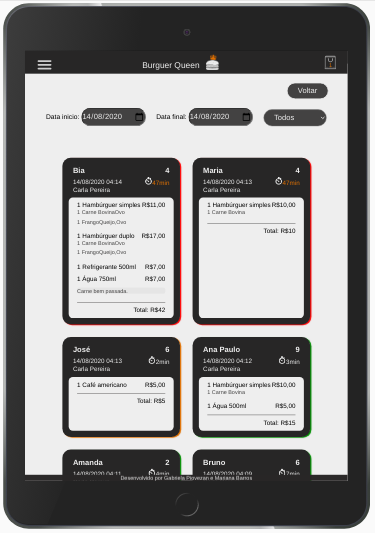

# Burguer Queen

Para acessar a página [clique aqui](https://burgerqueen-004.web.app/).

```sh
Login Cozinha: cozinha@cozinha.com
Senha: 123456

Login Salão: salao@salao.com
Senha:123456
```

## Índice

- [1. Introdução](#1-introdução)
- [2. Definições do projeto](#2-definições-do-projeto)
- [3. Desenvolvimento](#3-desenvolvimento)
- [4. Estrutura e funcionalidades](#4-estrutura-e-funcionalidades)
- [5. Considerações técnicas](#5-considerações-técnicas)
- [6. Implementações futuras](#6-implementações-futuras)
- [7. Autoria](#7-autoria)
- [8. Agradecimentos](#8-agradecimentos)

---

## 1. Introdução

O projeto **Burguer Queen** tem como objetivo atender uma hamburgueria de porte pequeno que necessita de uma interface que possibilite realizar pedidos utilizando um tablet, e enviá-los para a cozinha para que sejam preparados de forma ordenada e eficiente.


Informações do cliente:

> Somos **Burger Queen**, um fast food 24hrs.
>
> A nossa proposta de serviço 24 horas foi muito bem recebida e, para continuar a
> crescer, precisamos de um sistema que nos ajude a receber pedidos de nossos
> clientes.
>
> Nós temos 2 menus. Um muito simples para o café da manhã:
>
> | Ítem                  | Preço R\$ |
> | --------------------- | --------- |
> | Café americano        | 5         |
> | Café com leite        | 7         |
> | Misto Quente          | 10        |
> | Suco de fruta natural | 7         |
>
> E outro menu para o resto do dia:
>
> | Ítem                | Preço   |
> | ------------------- | ------- |
> | **Hambúrgueres**    | **R\$** |
> | Hambúrguer simples  | 10      |
> | Hambúrguer duplo    | 15      |
> | **Acompanhamentos** | **R\$** |
> | Batata frita        | 5       |
> | Anéis de cebola     | 5       |
> | **Bebidas**         | **R\$** |
> | Água 500ml          | 5       |
> | Água 750ml          | 7       |
> | Refrigerante 500ml  | 7       |
> | Refrigerante 750ml  | 10      |
>
> **Importante:** Os clientes podem escolher entre hambúrgueres de carne bovina,
> frango ou vegetariano. Além disso, por um adicional de R\$ 1,00 , eles podem
> adicionar queijo ou ovo.
>
> Nossos clientes são bastante indecisos, por isso é muito comum que eles mudem o
> seu pedido várias vezes antes de finalizar.

A interface deve mostrar os dois menus (café da manhã e restante do dia), cada
um com todos os seus _produtos_. O usuário deve poder escolher que _produtos_
adicionar e a interface deve mostrar o _resumo do pedido_ com o custo total.

## 2. Definições do projeto

### Usuário

Funcionários de uma hamburgueria que fazem atendimento no salão anotando pedidos e que trabalham na cozinha execultando.

### Objetivo

Criar interfaces visuais para facilitar o sistema de pedidos de uma hamburgueria disponíveis para acesso de acordo com o login do usuário.

O usuário que trabalha no salão pode criar pedidos, os enviar para a cozinha e verificar os pedidos que estão prontos para entrega.

Os funcionários da cozinha podem verificar os pedidos em ordem cronológica e enviá-los de volta para o salão quando estiverem finalizados.

## 3. Desenvolvimento

### Sobre a página

Com objetivo de manter um ambiente agradável para o usuário, foi decidido utilizar uma paleta de cores neutras.


O artigo [Dark UIs: the dos and don’ts.](https://uxdesign.cc/dark-uis-the-good-and-the-bad-dos-and-donts-edefe7a0084e) diz que:

_A fadiga ocular digital é uma condição comum que afeta milhões de pessoas diariamente. Causando, desde o uso excessivo do computador até a exposição regular à luz forte, pode causar dores de cabeça, dores no pescoço, visão turva e queimação / ardência nos olhos._

A fim minimizar a fadiga ocular do usuário que trabalha no salão, onde passará horas anotando pedidos, foram projetadas telas com tema escuro.

Segundo Bauer, D., & Cavonius, C., R. (1980), em um ensaio proposto foi constatado que os textos escuros no fundo claro possui maior legibilidade, os participantes do estudo eram 26% mais precisos ao ler um texto nessas condições.

Para facilitar a compreensão dos pedidos que serão lidos pelo usuário que trabalha na cozinha onde precisará olhar para tela o suficiente para ler o pedido, as telas foram projetadas com tema claro por oferecer melhor legibilidade.

### Protótipo

Um protótipo de alta fidelidade das telas foi projetado preferencialmente no formato para tablet, mas com a possibilidade de funcionamento em outros formatos, utilizando a plataforma figma.


Tela de login


Tela de registro


Tela do menu de jantar


Tela do menu jantar com opções de hambúrgueres


Tela do menu de café da manhã


Tela dos pedidos


Modal de verificação

### Histórias de Usuário

#### HU 1: Criar perfil

- [x] Poder realizar cadastro com e-mail, senha e função.
- [x] Poder realizar login com e-mail e senha.
- [x] Redirecionar para a tela correta.

#### HU 2: Anotar pedidos

- [x] Digitar o nome do cliente e mesa.
- [x] Filtrar _menu_ para _café da manhã_ e _almoço/jantar_.
- [x] Adicionar item ao pedido.
- [x] Excluir item do pedido.
- [x] Mostrar _resumo_ do pedido com todos os itens e o total.
- [x] Enviar para a cozinha (isso deve salvar o pedido).

#### HU 3: Ver pedidos na cozinha

- [x] Visualizar pedidos pendentes para produção.
- [x] Marcar pedido como pronto para entrega.
- [x] Ver histórico dos pedidos.

#### HU 4: Entrega de pedidos

- [x] Visualizar pedidos pendentes para entrega.
- [x] Marcar pedido como entregue ao cliente.

### UX

- [x] Funciona bem em tablets.
- [x] Fácil utilização em telas sensíveis ao toque.
- [x] Status atual do pedido sempre visível enquanto fazemos um pedido.

## 4. Estrutura e funcionalidades

A aplicação possui 5 telas: login, registro, pedidos, histórico e cozinha onde:

- O usuário pode logar com email senha.
- Também pode se registrar como um novo usuário informando o posto de trabalho.

Como usuário logado o funcionário que trabalha no salão pode:

- Criar pedidos novos.
- Visualizar os pedidos finalizados pela cozinha.
- Visualizar o histórico de pedidos e fazer uma busca por data e status do pedido.
- Finalizar o pedido depois da entrega.


Tela de pedido


Tela responsiva
Como usuário logado o funcionário que trabalha na cozinha pode:

- Visualizar os novos pedidos.
- Finalizar o preparo do pedido após a execução.
- Visualizar o histórico de pedidos e fazer uma busca por data e status do pedido.

O resumo do pedido possuí as seguintes informações:

- Nome do cliente
- Número da mesa
- Data e hora da criação do pedido
- Tempo de execução do pedido
  (Quando o pedido ainda não foi finalizado, esse valor é estatístico levando em consideração o histórico de pedidos anteriores)
- Nome do garçom
- Itens do pedido

Os pedidos são divididos em três categorias organizadas por cores:

- Vermelha: Pedido sendo preparado
- Laranja: Pedido pronto, aguardando entrega
- Verde: Pedido finalizado



Histórico de pedidos

## 5. Considerações técnicas

Para a construção do site foi utilizado o software _Visual Studio Code_, utilizando _React_, _NPM_, _Yarn_ e _Git_.  
Sua estilização foi feita em _CSS3_, suas telas são responsivas mas foram programadas preferencialmente para utilização em tablet, o flexbox foi utilizando para o posicionamento dos elementos.  
A manipulação e persistência dos dados foi feita com Firebase através de um banco de dados não relacional, em tempo real, implementando operações CRUD (Criação, Leitura, Atualização e Remoção) de dados.
Foram utilizadas as bibliotecas _react-flatpickr_ e _react-toastify_ para o filtro por data e alertas.
_[Firebase](https://firebase.google.com/)_ (Hosting, Auth, Database e Firestore).  
Colaboração e armazenamento com _GitHub_.  
Organização com _Trello_.  
Interface hospedada usando _Firebase Hosting_.

### Instalação e execução. :octocat:

- [Clone](https://help.github.com/articles/cloning-a-repository/) o projeto na sua máquina executando o seguinte comando no seu terminal:

```sh
git clone (link-do-repositório)
```

- Instale as dependências do projeto com o comando:

```sh
yarn install
```

- Rode o projeto na sua máquina com:

```sh
npm start
```

- E visualize o projeto no seu navegador com o link:

```sh
http://localhost:3000
```

## 6. Implementações futuras

Futuramente serão implementadas funcionalidades para melhoria da experiência do usuário:

- Estatísticas de acordo com dia da semana e horário para calcular tempo médio do pedido.
- Estatísticas de funcionários.
- Perfil dos funcionários.
- Alteração de cadastro do funcionário.
- Número do pedido.

## 7. Autoria

Este projeto foi feito por [Gabriela Piovezan](https://github.com/gabrielapiovezan) e [Mariana Barros](https://github.com/MarianaMBarros) com base no projeto da [Laboratoria](https://github.com/Laboratoria).

## 8. Agradecimentos

- [Laboratoria](https://github.com/Laboratoria).
- Ícones e vetores: [Freepik](https://www.flaticon.com/br/autores/freepik), [Pixel Perfect](https://www.flaticon.com/br/autores/pixel-perfect) e [Those Icons](https://www.flaticon.com/br/autores/those-icons).
